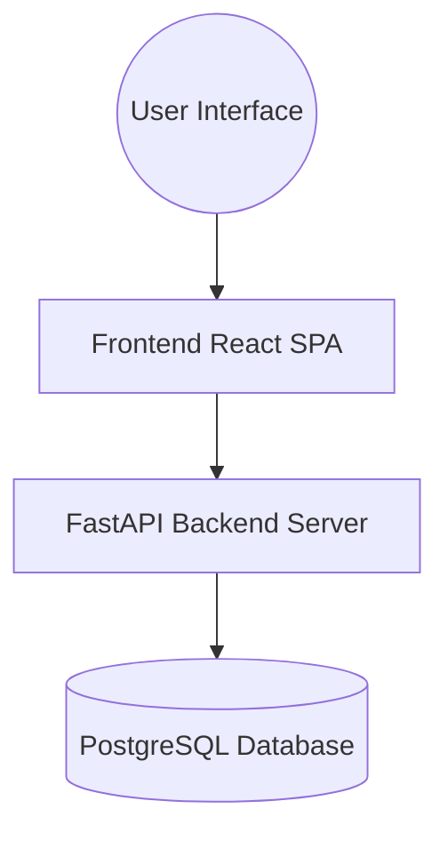

# Architecture Overview

The EBI Vila Paula project is built using a modern decoupled architecture. The frontend application and backend API communicate over standard HTTP/REST.

## High-Level Diagram

## The Frontend (React + Vite)
- The frontend is a Single Page Application (SPA), using React Router for navigation.
- **State Management**: Built primarily with React Context API (e.g., AuthContext).
- **Styling**: Tailwind CSS combined with shadcn/ui.
- **Deployment**: Configured to run locally via `npm run dev` or packaged in a production Docker container serving compiled static files.

## The Backend (FastAPI + Python)
- Provides a fast, async-ready RESTful JSON API.
- **ORM**: SQLAlchemy is used for robust mapping between Python objects and database tables.
- **Migrations**: Alembic handles database schema revisions.
- **Authentication**: Uses standard JWT (JSON Web Tokens) for stateless authentication.

## Database (PostgreSQL)
- Stores all entities (Users, Children, Guardians, Events, Attendances).
- UTC timezones are standardized across all tables, converting to local timeviews purely on the frontend layer.
